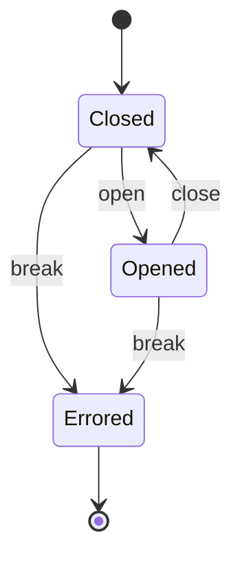
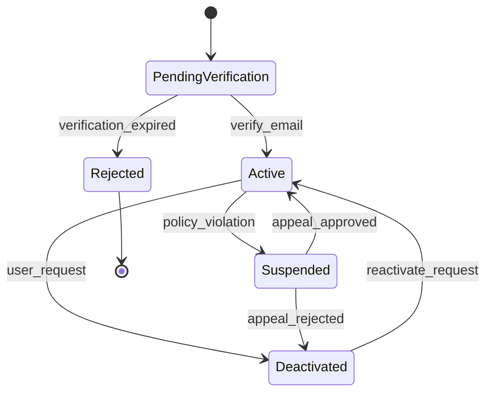
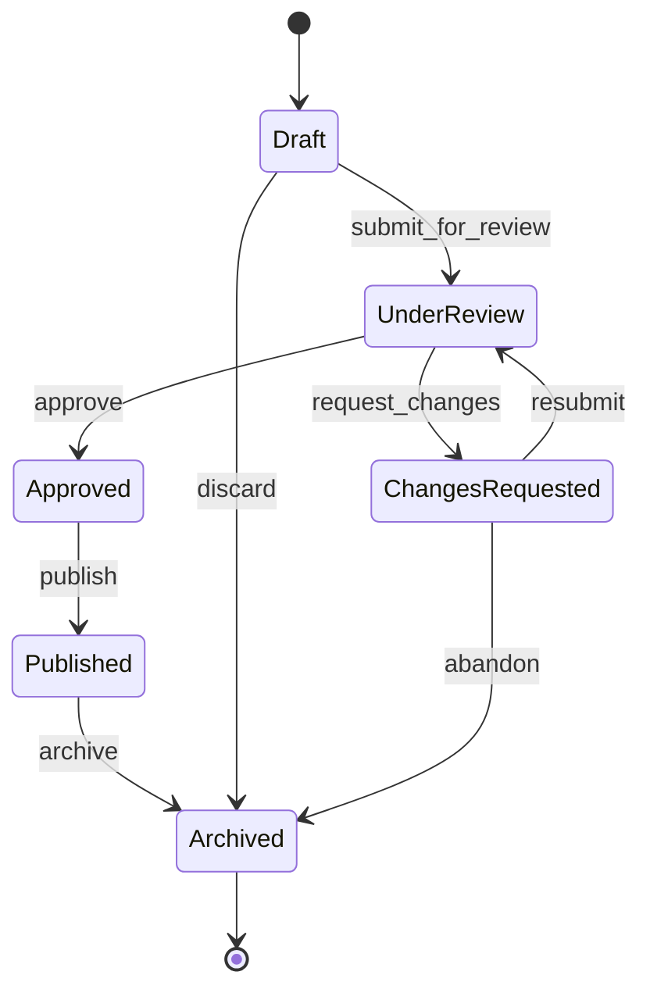
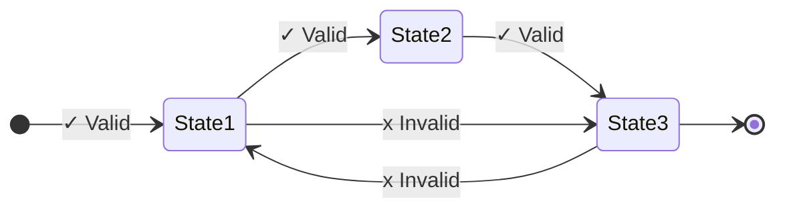
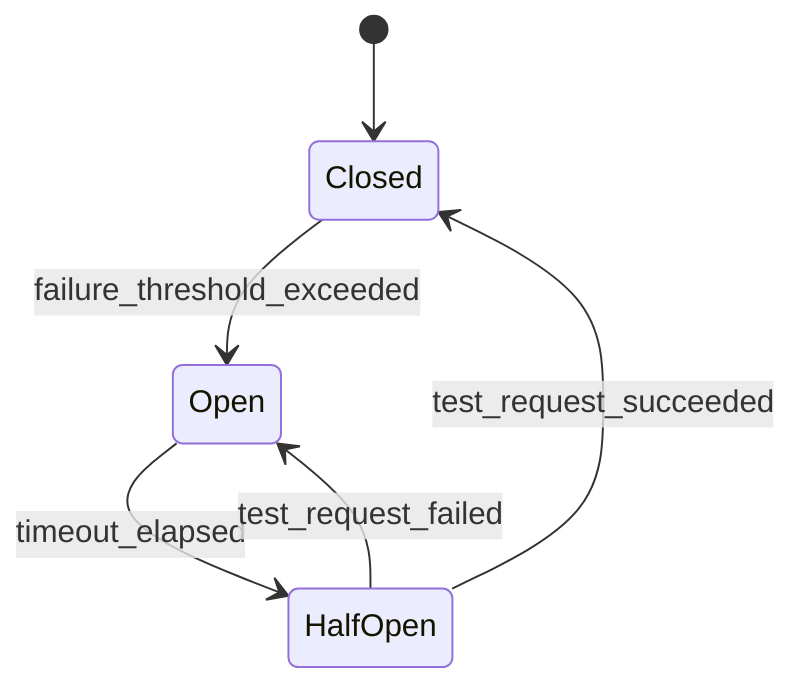
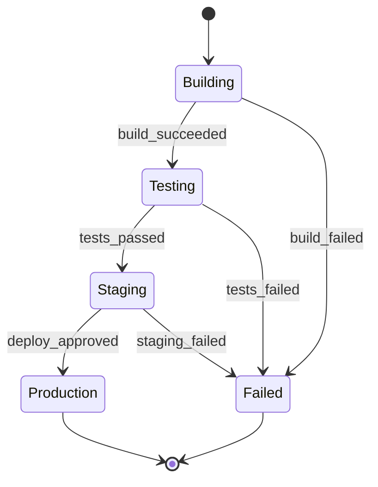
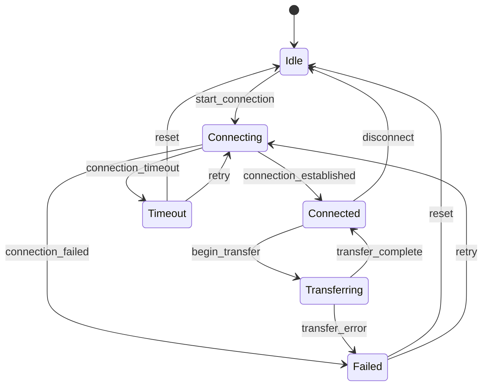

[](http://blog.codinghorror.com/the-best-code-is-no-code-at-all/)
[](https://codeclimate.com/github/hopsoft/state_jacket/maintainability)
[](https://github.com/hopsoft/state_jacket/actions/workflows/test.yml)
[](https://coveralls.io/r/hopsoft/state_jacket?branch=master)
[](http://rubygems.org/gems/state_jacket)

# StateJacket

## An Intuitive [State Transition System](http://en.wikipedia.org/wiki/State_transition_system) & [State Machine](https://en.wikipedia.org/wiki/Finite-state_machine)

StateJacket provides an intuitive approach to building complex state machines by **completely separating** the concerns of state transition logic and state machine behavior. This architectural decision makes your state machines faster, more testable, and easier to reason about.

Think of it as the difference between a well-designed class with clear responsibilities versus a monolithic blob that does everything. StateJacket gives you the tools to build state machines that won't make your future self want to travel back in time and have words with your past self.

## Install

```sh
gem install state_jacket
```

## Core Concepts: Two-Layer Architecture

StateJacket's power comes from its **two-layer architecture** that separates concerns like a well-engineered system should:

1. **StateTransitionSystem** - Defines _what_ transitions are possible
2. **StateMachine** - Defines _when_ events trigger those transitions

This separation means you can reason about your state logic independently, test transition rules without events, and reuse transition systems across different machines. It's like having a blueprint (transition system) and a constructor (state machine) - each with clear responsibilities.

## Quick Example: Turnstile

Let's build a [turnstile](http://en.wikipedia.org/wiki/Finite-state_machine#Example:_a_turnstile) to see StateJacket in action:




### Step 1: Define the State Transition System

```ruby
# Define the "rules" - what transitions are possible
system = StateJacket::StateTransitionSystem.new
system.add :opened => [:closed, :errored] # opened can go to closed or errored
system.add :closed => [:opened, :errored] # closed can go to opened or errored
system.add :errored                       # errored is terminal (no outgoing transitions)
system.lock                               # lock it down - no more changes allowed

# Introspect the system
system.to_h.inspect  # => {"closed"=>["opened", "errored"], "errored"=>nil, "opened"=>["closed", "errored"]}
system.states        # => ["closed", "errored", "opened"]
system.transitioners # => ["closed", "opened"]
system.terminators   # => ["errored"]

# Test transition validity
system.can_transition? :opened => :closed  # => true
system.can_transition? :closed => :opened  # => true
system.can_transition? :errored => :opened # => false (errored is terminal)
```

> **Why Hash Rockets (`=>`) Instead of Modern Hash Syntax?**
>
> StateJacket examples deliberately use `=>` for transitions because **direction matters**. The hash rocket visually represents the flow from one state to another, making state machines easier to read and reason about at a glance:
>
> ```ruby
> system.add :draft => :published # Clear: draft flows TO published
> system.add draft: :published    # Less clear: what's the relationship?
> ```
>
> This visual clarity becomes invaluable when defining complex workflows with many states and transitions.

### Step 2: Create the State Machine

```ruby
# Create a machine using the system, starting in "closed" state
machine = StateJacket::StateMachine.new(system, state: "closed")

# Define events that trigger the transitions
machine.on :open,  :closed => :opened                         # "open" event: closed to opened
machine.on :close, :opened => :closed                         # "close" event: opened to closed
machine.on :break, {:closed => :errored, :opened => :errored} # "break" event: any to errored
machine.lock                                                  # lock it down (prevents changes)

# Introspect the machine
machine.to_h   # => {"open"=>[{"closed"=>"opened"}], "close"=>[{"opened"=>"closed"}], "break"=>[{"closed"=>"errored"}, {"opened"=>"errored"}]}
machine.events # => ["open", "close", "break"]
machine.state  # => "closed"

# Check event availability
machine.is_event? :open     # => true
machine.is_event? :foo      # => false
machine.can_trigger? :open  # => true (can open from closed)
machine.can_trigger? :close # => false (can't close when already closed)

# Trigger transitions
machine.trigger :open
machine.state # => "opened"

machine.trigger :close
machine.state # => "closed"

# Transition with callback
machine.trigger :open do |from_state, to_state|
  puts "Transitioning from #{from_state} to #{to_state}"
  # Custom logic here - logging, notifications, etc.
end
# => "Transitioning from closed to opened"

machine.state # => "opened"

# Failed transitions return nil
machine.trigger :open # => nil (already opened)
machine.state         # => "opened" (no change)

# Exception handling in callbacks
begin
  machine.trigger :close do |from_state, to_state|
    raise "Something went wrong!"
  end
rescue StandardError
  # Transition is rolled back on exception
end
machine.state # => "opened" (transition didn't complete)
```

## Complete Feature Reference

### StateTransitionSystem: The Foundation

The `StateTransitionSystem` is your state machine's blueprint. It defines the valid states and transitions without any event logic.

```ruby
system = StateJacket::StateTransitionSystem.new

# Add states with transitions
system.add :pending => [:processing, :cancelled]
system.add :processing => [:completed, :failed]
system.add :completed            # terminal state (no outgoing transitions)
system.add :cancelled            # another terminal state
system.add :failed => [:pending] # failed orders can be retried

system.lock                      # Always lock when done - prevents accidental modifications
```

**Return Values:** All methods return meaningful values for chaining and introspection. `trigger` returns the new state on success or `nil` on invalid transitions, making it easy to handle both success and failure cases.

<details>
<summary><strong>StateTransitionSystem API Reference</strong></summary>

```ruby
# Introspection
system.states        # => ["processing", "cancelled", "pending", "completed", "failed"]
system.transitioners # => ["processing", "pending", "failed"] (states with outgoing transitions)
system.terminators   # => ["cancelled", "completed"] (terminal states)

# State validation
system.is_state?(:pending)        # => true
system.is_state?(:invalid)        # => false
system.is_transitioner?(:pending) # => true (has outgoing transitions)
system.is_terminator?(:completed) # => true (no outgoing transitions)

# Transition validation
system.can_transition?(:pending => :processing) # => true
system.can_transition?(:completed => :pending)  # => false

# Multiple target validation
system.can_transition?(:pending => [:processing, :cancelled]) # => true (both valid)
system.can_transition?(:pending => [:processing, :invalid])   # => false (invalid not valid)

# Export the transition rules
system.to_h
# => {"processing"=>["completed", "failed"], "cancelled"=>nil, "pending"=>["processing", "cancelled"],
#     "completed"=>nil, "failed"=>["pending"]}
```

</details>

### StateMachine: The Behavior Engine

The `StateMachine` brings your transition system to life with events and behavior.

```ruby
# Initialize with a transition system and starting state
machine = StateJacket::StateMachine.new(system, state: :pending)

# Define events that trigger transitions
machine.on :start, :pending => :processing
machine.on :complete, :processing => :completed
machine.on :fail, :processing => :failed
machine.on :cancel, :pending => :cancelled # only pending can be cancelled
machine.on :retry, :failed => :pending

machine.lock # Lock when configuration is complete
```

<details>
<summary><strong>StateMachine API Reference</strong></summary>

```ruby
# Current state
machine.state # => "pending"

# Event introspection
machine.events                  # => ["start", "complete", "fail", "cancel", "retry"]
machine.is_event?(:start)       # => true
machine.can_trigger?(:start)    # => true (valid from current state)
machine.can_trigger?(:complete) # => false (not valid from pending)

# Convenience methods for current state
machine.triggerable_events      # => ["start", "cancel"] (events that can be triggered now)
machine.reachable_states        # => ["processing", "cancelled"] (states reachable from current state)
machine.terminal?               # => false (current state has outgoing transitions)
machine.state_symbol            # => :pending (current state as symbol)

# Triggering events
result = machine.trigger(:start)
result        # => "processing" (returns new state)
machine.state # => "processing"

# Events that can't be triggered return nil
machine.trigger(:start) # => nil (already in processing)

# Transition callbacks
machine.trigger(:complete) do |from_state, to_state|
  OrderMailer.completion_notice(from_state, to_state).deliver_now
  Analytics.track_completion(order_id: @order.id)
end

# Export event configuration
machine.to_h
# => {"start"=>[{"pending"=>"processing"}], "complete"=>[{"processing"=>"completed"}], ...}
```

</details>

### Advanced Features

<details>
<summary><strong>Advanced Features</strong></summary>

#### Type Flexibility & Type Safety

StateJacket works with any type that responds to `to_s` and includes comprehensive **RBS type definitions** for enhanced developer experience:

```ruby
system = StateJacket::StateTransitionSystem.new
system.add 1 => [2, 3]            # integers
system.add "draft" => "published" # strings
system.add :active => :inactive   # symbols
system.add nil => "initialized"   # even nil (becomes "")

machine = StateJacket::StateMachine.new(system, state: 1)
machine.on :next, 1 => 2
machine.state # => "1" (always normalized to string)
```

**RBS Support:** StateJacket includes complete RBS type definitions, enabling rich IDE support, static analysis, and better refactoring tools for Ruby 3.x projects.

#### Complex Transition Patterns

```ruby
# One event, multiple possible transitions based on source state
machine.on :advance, {
  :draft => :review,
  :review => :published,
  :published => :archived
}

# One event, same destination from multiple sources
machine.on :reset, {:draft => :draft, :review => :draft, :published => :draft}

# Conditional logic in your domain objects
class DocumentWorkflow
  def publish!
    return {error: "Not ready"} unless ready_to_publish?
    return {error: "No permission"} unless user_can_publish?

    @machine.trigger(:publish) do |from, to|
      @document.published_at = Time.current
      NotificationService.notify_subscribers(@document)
    end

    {success: true}
  end

  private

  def ready_to_publish?
    @document.content.present? && @document.reviewed?
  end

  def user_can_publish?
    @user.can?(:publish, @document)
  end
end
```

#### Thread Safety & Immutability

StateJacket is designed for thread safety through immutability:

```ruby
system = StateJacket::StateTransitionSystem.new
system.add :a => :b
system.lock # Freezes internal structures

# This will raise an exception
begin
  system.add :c => :d
rescue RuntimeError => e
  e.message # => "states cannot be added after locking"
end

# Same for machines
machine = StateJacket::StateMachine.new(system, state: :a)
machine.on :go, :a => :b
machine.lock

begin
  machine.on :back, :b => :a
rescue RuntimeError => e
  e.message # => "events cannot be added after locking"
end
```

</details>

<details>
<summary><strong>Integration Patterns</strong></summary>

StateJacket integrates beautifully with any architecture:

```ruby
# ActiveRecord integration
class Order < ApplicationRecord
  enum status: {pending: 0, processing: 1, completed: 2, cancelled: 3}

  def workflow
    @workflow ||= OrderWorkflow.new(self)
  end

  # Delegate common methods
  delegate :can_transition_to?, :current_state, :available_transitions, to: :workflow
end

class OrderWorkflow
  def initialize(order)
    @order = order
    @machine = build_machine
  end

  def process!
    return false unless valid_for_processing?

    @machine.trigger(:process) do |from, to|
      @order.update!(
        status: to,
        processed_at: Time.current,
        processor_id: Current.user.id
      )
    end
  end

  private

  def build_machine
    system = StateJacket::StateTransitionSystem.new
    system.add :pending => [:processing, :cancelled]
    system.add :processing => [:completed, :cancelled]
    system.add :completed
    system.add :cancelled
    system.lock

    machine = StateJacket::StateMachine.new(system, state: @order.status)
    machine.on :process, :pending => :processing
    machine.on :complete, :processing => :completed
    machine.on :cancel, :pending => :cancelled
    machine.lock
    machine
  end

  def valid_for_processing?
    @order.payment_confirmed? && @order.inventory_available?
  end
end
```

</details>

## Business Logic & Validation Philosophy

StateJacket intentionally omits "guards" and complex DSL magic. Why? Because your business logic deserves better than being hidden in state machine configuration.

**The Performance Advantage:** By keeping business logic separate, you can optimize where it actually matters. State transitions themselves are blazingly fast (1.4+ million/second), but your database queries, API calls, and business rules are where real bottlenecks occur. StateJacket's architecture lets you optimize these independently.

### The StateJacket Way: Explicit Over Implicit

```ruby
# Other libraries: Hidden business logic in DSL
# state_machine do
#   event :process, guard: :payment_valid? do
#     transitions from: :pending, to: :processing
#   end
# end

# StateJacket: Explicit business logic in your domain
class PaymentProcessor
  def process!
    return failure("Payment invalid") unless payment_valid?
    return failure("Insufficient funds") unless sufficient_funds?

    @machine.trigger(:process) do |from, to|
      charge_payment
      send_confirmation_email
    end

    success("Payment processed")
  end

  private

  def payment_valid?
    @payment.present? && @payment.verified?
  end

  def sufficient_funds?
    @account.balance >= @amount
  end
end
```

### Recommended Patterns

#### 1. Explicit Validation Methods

```ruby
class OrderProcessor
  def ship!
    return error("Invalid address") unless valid_shipping_address?
    return error("Out of stock") unless inventory_available?
    return error("Payment pending") unless payment_confirmed?

    @machine.trigger(:ship) do |from, to|
      create_shipping_label
      update_inventory
      notify_customer
    end

    success("Order shipped")
  end

  private

  def valid_shipping_address?
    @order.shipping_address&.complete? && @order.shipping_address&.verified?
  end

  def inventory_available?
    @order.line_items.all? { |item| item.quantity <= item.product.stock_count }
  end

  def payment_confirmed?
    @order.payment&.confirmed?
  end
end
```

#### 2. Validator Objects

```ruby
class DocumentPublisher
  def publish!
    validation = DocumentValidator.new(@document, @user).validate
    return validation unless validation.success?

    @machine.trigger(:publish) do |from, to|
      @document.update!(
        published_at: Time.current,
        published_by: @user
      )
      NotificationService.notify_subscribers(@document)
    end

    Result.success("Document published")
  end
end

class DocumentValidator
  def initialize(document, user)
    @document = document
    @user = user
  end

  def validate
    errors = []
    errors << "Content cannot be blank" if @document.content.blank?
    errors << "Document must be reviewed" unless @document.reviewed?
    errors << "User lacks permission" unless @user.can_publish?(@document)
    errors << "Document has unresolved comments" if @document.unresolved_comments.any?

    errors.empty? ? Result.success : Result.failure(errors)
  end
end
```

#### 3. Command Objects

```ruby
class ActivateUserAccount
  def initialize(user, activation_token)
    @user = user
    @activation_token = activation_token
    @machine = build_machine
  end

  def call
    return failure("Invalid token") unless valid_token?
    return failure("Token expired") if token_expired?
    return failure("Account already active") if @user.active?

    @machine.trigger(:activate) do |from, to|
      @user.update!(
        status: 'active',
        activated_at: Time.current,
        activation_token: nil
      )
      WelcomeMailer.deliver_to(@user)
    end

    success("Account activated successfully")
  end

  private

  def valid_token?
    @user.activation_token.present? &&
    ActiveSupport::SecurityUtils.secure_compare(@user.activation_token, @activation_token)
  end

  def token_expired?
    @user.activation_token_expires_at < Time.current
  end

  def build_machine
    system = StateJacket::StateTransitionSystem.new
    system.add :pending => :active
    system.add :active
    system.lock

    machine = StateJacket::StateMachine.new(system, state: @user.status)
    machine.on :activate, :pending => :active
    machine.lock
    machine
  end
end
```

### Why This Approach Wins

- **Testable**: Business logic can be unit tested independently from state transitions
- **Readable**: Validation flow is explicit and easy to follow
- **Flexible**: Complex conditional logic doesn't get crammed into DSL constraints
- **Maintainable**: Business rules live in domain objects where they belong
- **Debuggable**: No "magic" - you can trace exactly what's happening
- **Migratable**: Easy to refactor and move between different state machine libraries

**Migration Made Easy:** StateJacket's explicit patterns make it straightforward to migrate from other state machine libraries. Simply extract your business logic from guards/callbacks into explicit validation methods, and you'll have cleaner, more testable code.

StateJacket does one thing exceptionally well: fast, clean state transitions. Your domain objects handle business logic validation where it can be properly tested, maintained, and understood by your future self.

## Error Handling & Debugging

StateJacket provides clear, actionable error messages and excellent debugging capabilities:

### Common Errors and Solutions

```ruby
# 1. Invalid state error
system = StateJacket::StateTransitionSystem.new
system.add :pending => :processing
system.lock

# This will raise: ArgumentError("illegal state")
machine = StateJacket::StateMachine.new(system, state: :invalid)

# 2. Illegal transition error
machine = StateJacket::StateMachine.new(system, state: :pending)
# This will raise: ArgumentError("illegal transition")
machine.on :jump, :pending => :completed  # :completed not defined in system

# 3. Mutation after locking
system.lock
# This will raise: RuntimeError("states cannot be added after locking")
system.add :new_state

# 4. Event triggering before locking
machine.on :process, :pending => :processing
# This will raise: RuntimeError("must be locked before triggering events")
machine.trigger(:process)
```

### Debugging State Machines

StateJacket provides excellent introspection capabilities:

```ruby
# Inspect current state and available transitions
puts "Current state: #{machine.state}"
puts "Available events: #{machine.events}"
puts "Can process?: #{machine.can_trigger?(:process)}"

# Debug transition system
puts "All states: #{system.states}"
puts "Transitioners: #{system.transitioners}"
puts "Terminal states: #{system.terminators}"

# Trace transition logic
machine.trigger(:process) do |from, to|
  logger.info "State transition: #{from} -> #{to}"
  # Add breakpoints, logging, metrics here
end

# Export machine configuration for inspection
pp machine.to_h  # Pretty print the entire event/transition mapping
```

### Error Recovery Patterns

```ruby
# Graceful error handling
class OrderProcessor
  def process!
    return failure("Invalid state") unless machine.can_trigger?(:process)

    machine.trigger(:process) do |from, to|
      # This could fail
      PaymentService.charge(@order)
    end

    success("Processed")
  rescue PaymentError => e
    machine.trigger(:fail) if machine.can_trigger?(:fail)
    failure("Payment failed: #{e.message}")
  end

  private

  def failure(message)
    { success: false, error: message, state: machine.state }
  end

  def success(message)
    { success: true, message: message, state: machine.state }
  end
end
```

## Comparison with Other Ruby State Machine Libraries

StateJacket deliberately focuses on simplicity and separation of concerns, making it distinct from feature-rich alternatives. Here's how it compares:

| Library            | Complexity | DB/Rails  | Guards      | Best For                                           |
| ------------------ | ---------- | --------- | ----------- | -------------------------------------------------- |
| **state_jacket**   | Simple     | Explicit  | Explicit    | All use cases with explicit, maintainable patterns |
| **aasm**           | Moderate   | Native    | Rich DSL    | Rails apps, ActiveRecord models                    |
| **state_machines** | Complex    | Multi-ORM | Full        | Enterprise apps, complex rules                     |
| **statesman**      | Moderate   | Built-in  | None        | Audit trails, compliance                           |
| **workflow**       | Simple     | Custom    | Conditional | Simple workflows, legacy support                   |
| **finite_machine** | Moderate   | None      | Advanced    | Event-driven applications, standalone              |

### Detailed Comparison

#### state_jacket

**Strengths:** Clean separation of concerns, explicit validation patterns, minimal overhead, modern Ruby features
**Trade-offs:** Requires explicit implementation of database persistence, callbacks, and Rails integration patterns
**Approach:** Uses explicit validation methods, validator objects, and command patterns for complex scenarios
**Use Case:** Clean architecture applications, explicit business logic validation, maintainable systems

#### aasm (Acts As State Machine)

**Strengths:** Mature ecosystem (5.1k stars), feature-rich DSL, excellent Rails/ActiveRecord integration, extensive ORM support (Mongoid, Sequel, etc.), comprehensive callback system, rich guard conditions
**Trade-offs:** Higher complexity, can be opinionated with "magic" methods, steeper learning curve for advanced features
**Use Case:** Rails applications requiring built-in database persistence, complex workflows with rich callback systems

#### state_machines

**Strengths:** Most comprehensive feature set, supports any Ruby class, multiple ORM adapters, extensive customization options, mature codebase, conditional transitions, path analysis
**Trade-offs:** High complexity, steep learning curve, requires separate integration gems for modern ORMs, can be over-engineered for simple use cases
**Use Case:** Enterprise applications with complex business rules, applications needing multiple persistence layers or extensive customization

#### statesman

**Strengths:** Built-in audit trails with full transition history, clean separation of state machine logic from models, robust data integrity with database indices, JSON metadata support, transaction safety
**Trade-offs:** Requires separate transition model, no built-in guard conditions (explicit validation required), more database overhead
**Use Case:** Applications requiring comprehensive audit trails, regulatory compliance, financial systems needing transition history

#### workflow

**Strengths:** Very simple API, finite-state-machine-inspired design, lightweight with minimal dependencies, easy to understand, supports conditional transitions, custom persistence adapters
**Trade-offs:** No built-in Rails integration, requires custom persistence implementation, simpler feature set, ActiveRecord support extracted to separate gem
**Use Case:** Simple state workflows, applications needing custom persistence, legacy systems, minimal overhead scenarios

#### finite_machine

**Strengths:** Clean event-driven design, choice pseudostates for conditional logic, thread-safe operations, comprehensive callback system, good balance of features and simplicity, plain Ruby object support
**Trade-offs:** No built-in Rails/ORM integration, smaller community (806 stars), requires custom persistence implementation
**Use Case:** Event-driven applications, standalone state machines, applications requiring thread safety, complex conditional transitions

### Why Choose StateJacket?

StateJacket excels when you value:

- **Clean Architecture** - Clear separation between state transitions and business logic
- **Minimal Overhead** - Clean implementation adds negligible performance cost
- **Explicit Validation** - Business logic validation using standard Ruby patterns rather than DSL magic
- **Independent Testing** - Business logic and state transitions tested separately for better maintainability
- **Simple Mental Model** - Easy to understand and reason about without hidden behavior
- **Modern Ruby** - Leverages Ruby 3.x features with comprehensive RBS types
- **Future-Proof** - Explicit patterns age well and remain maintainable over time

**When Performance Actually Matters:** Choose StateJacket for high-throughput systems, real-time applications, or anywhere state changes happen frequently. The minimal overhead means you can focus optimization efforts on your business logic and database operations where they'll have real impact.

state_jacket can handle complex scenarios through explicit patterns documented above. Choose alternatives when you prefer built-in database persistence, callback systems, or Rails integration over explicit implementation patterns.

## Real-World Examples

Let's see StateJacket tackle some common scenarios:

<details>
<summary><strong>Real-World Examples</strong></summary>

### E-Commerce Order Processing

```ruby
class OrderProcessor
  def initialize(order)
    @order = order
    @machine = build_order_machine
  end

  def submit!
    return failure("Cart is empty") if @order.line_items.empty?

    @machine.trigger(:submit) do |from, to|
      @order.update!(status: to, submitted_at: Time.current)
      InventoryService.reserve_items(@order.line_items)
    end

    success("Order submitted")
  end

  def process_payment!
    return failure("Payment failed") unless payment_service.charge!

    @machine.trigger(:pay) do |from, to|
      @order.update!(status: to, paid_at: Time.current)
      EmailService.send_confirmation(@order)
    end

    success("Payment processed")
  end

  def ship!
    return failure("Address invalid") unless shipping_address_valid?

    @machine.trigger(:ship) do |from, to|
      @order.update!(
        status: to,
        shipped_at: Time.current,
        tracking_number: ShippingService.create_shipment(@order)
      )
    end

    success("Order shipped")
  end

  private

  def build_order_machine
    system = StateJacket::StateTransitionSystem.new
    system.add :cart => [:submitted, :cancelled]
    system.add :submitted => [:paid, :cancelled]
    system.add :paid => [:shipped, :refunded]
    system.add :shipped => [:delivered, :returned, :refunded]
    system.add :delivered => [:returned, :refunded]
    system.add :cancelled
    system.add :refunded
    system.add :returned
    system.lock

    machine = StateJacket::StateMachine.new(system, state: @order.status)
    machine.on :submit, :cart => :submitted
    machine.on :pay, :submitted => :paid
    machine.on :ship, :paid => :shipped
    machine.on :deliver, :shipped => :delivered
    machine.on :cancel, {:cart => :cancelled, :submitted => :cancelled}
    machine.on :refund, {:paid => :refunded, :shipped => :refunded, :delivered => :refunded}
    machine.on :return, {:shipped => :returned, :delivered => :returned}
    machine.lock
    machine
  end
end
```

### User Account Lifecycle

User onboarding and management with clear state progression:



```ruby
class UserAccountManager
  def initialize(user)
    @user = user
    @machine = build_account_machine
  end

  def activate!(activation_code)
    return failure("Invalid code") unless valid_activation_code?(activation_code)

    @machine.trigger(:activate) do |from, to|
      @user.update!(
        status: to,
        activated_at: Time.current,
        activation_code: nil
      )
      WelcomeService.send_welcome_package(@user)
    end

    success("Account activated")
  end

  def suspend!(reason)
    @machine.trigger(:suspend) do |from, to|
      @user.update!(
        status: to,
        suspended_at: Time.current,
        suspension_reason: reason
      )
      NotificationService.notify_suspension(@user, reason)
    end
  end

  def deactivate!
    @machine.trigger(:deactivate) do |from, to|
      @user.update!(status: to, deactivated_at: Time.current)
      CleanupService.anonymize_user_data(@user)
    end
  end

  private

  def build_account_machine
    system = StateJacket::StateTransitionSystem.new
    system.add :pending => [:active, :rejected]
    system.add :active => [:suspended, :deactivated]
    system.add :suspended => [:active, :deactivated]
    system.add :deactivated => :active
    system.add :rejected
    system.lock

    machine = StateJacket::StateMachine.new(system, state: @user.status)
    machine.on :activate, :pending => :active
    machine.on :reject, :pending => :rejected
    machine.on :suspend, :active => :suspended
    machine.on :reactivate, {:suspended => :active, :deactivated => :active}
    machine.on :deactivate, {:active => :deactivated, :suspended => :deactivated}
    machine.lock
    machine
  end
end
```

### Document Approval Workflow

Multi-stage approval process with feedback loops:



```ruby
class DocumentWorkflow
  def initialize(document, user)
    @document = document
    @user = user
    @machine = build_document_machine
  end

  def submit_for_review!
    return failure("Content required") if @document.content.blank?

    @machine.trigger(:submit) do |from, to|
      @document.update!(
        status: to,
        submitted_at: Time.current,
        submitted_by: @user
      )
      ReviewService.assign_reviewer(@document)
    end
  end

  def approve!
    return failure("Not authorized") unless @user.can_approve?(@document)

    @machine.trigger(:approve) do |from, to|
      @document.update!(
        status: to,
        approved_at: Time.current,
        approved_by: @user
      )
      PublishingService.schedule_publication(@document)
    end
  end

  def request_changes!(feedback)
    @machine.trigger(:request_changes) do |from, to|
      @document.update!(status: to)
      @document.comments.create!(
        body: feedback,
        author: @user,
        comment_type: 'revision_request'
      )
    end
  end

  private

  def build_document_machine
    system = StateJacket::StateTransitionSystem.new
    system.add :draft => [:submitted, :archived]
    system.add :submitted => [:approved, :rejected, :needs_revision]
    system.add :needs_revision => [:submitted, :archived]
    system.add :approved => :published
    system.add :published => :archived
    system.add :rejected => [:draft, :archived]
    system.add :archived
    system.lock

    machine = StateJacket::StateMachine.new(system, state: @document.status)
    machine.on :submit, {:draft => :submitted, :needs_revision => :submitted}
    machine.on :approve, :submitted => :approved
    machine.on :reject, :submitted => :rejected
    machine.on :request_changes, :submitted => :needs_revision
    machine.on :publish, :approved => :published
    machine.on :archive, {:draft => :archived, :needs_revision => :archived, :rejected => :archived, :published => :archived}
    machine.on :revise, :rejected => :draft
    machine.lock
    machine
  end
end
```

</details>

<details>
<summary><strong>Testing StateJacket</strong></summary>

StateJacket's separation of concerns makes testing delightfully straightforward:

## Testing Patterns & Best Practices

### Visual Testing Documentation

When documenting tests, include the expected state flow:



### Advanced Workflow Patterns

#### Circuit Breaker Pattern

Implement resilient service interactions:



```ruby
system = StateJacket::StateTransitionSystem.new
system.add :closed => [:open]
system.add :open => [:half_open]
system.add :half_open => [:closed, :open]
system.lock

circuit_breaker = StateJacket::StateMachine.new(system, state: :closed)
circuit_breaker.on :trip, :closed => :open
circuit_breaker.on :attempt_reset, :open => :half_open
circuit_breaker.on :reset, :half_open => :closed
circuit_breaker.on :fail_again, :half_open => :open
circuit_breaker.lock
```

#### Deployment Pipeline

Model CI/CD workflows with clear progression:



### Testing State Transition Systems

```ruby
RSpec.describe "OrderTransitionSystem" do
  let(:system) do
    system = StateJacket::StateTransitionSystem.new
    system.add :pending => [:processing, :cancelled]
    system.add :processing => [:completed, :failed]
    system.add :completed
    system.add :cancelled
    system.add :failed => :pending
    system.lock
    system
  end

  it "defines all expected states" do
    expect(system.states.sort).to match_array(%w[cancelled completed failed pending processing])
  end

  it "identifies terminal states correctly" do
    expect(system.terminators.sort).to match_array(%w[cancelled completed])
  end

  it "validates legal transitions" do
    expect(system.can_transition?(pending: :processing)).to be true
    expect(system.can_transition?(processing: :completed)).to be true
    expect(system.can_transition?(failed: :pending)).to be true
  end

  it "rejects illegal transitions" do
    expect(system.can_transition?(completed: :pending)).to be false
    expect(system.can_transition?(cancelled: :processing)).to be false
  end
end
```

### Testing State Machines

```ruby
RSpec.describe "OrderStateMachine" do
  let(:system) { build_order_transition_system }
  let(:machine) { StateJacket::StateMachine.new(system, state: :pending) }

  before do
    machine.on :process, :pending => :processing
    machine.on :complete, :processing => :completed
    machine.on :cancel, [:pending, :processing] => :cancelled
    machine.lock
  end

  it "starts in the correct state" do
    expect(machine.state).to eq "pending"
  end

  it "transitions on valid events" do
    expect(machine.trigger(:process)).to eq "processing"
    expect(machine.state).to eq "processing"
  end

  it "returns nil for invalid transitions" do
    machine.trigger(:process)                    # Move to processing
    expect(machine.trigger(:process)).to be_nil # Can't process again
    expect(machine.state).to eq "processing"    # State unchanged
  end

  it "executes callbacks during transitions" do
    callback_executed = false

    machine.trigger(:process) do |from, to|
      callback_executed = true
      expect(from).to eq "pending"
      expect(to).to eq "processing"
    end

    expect(callback_executed).to be true
  end

  it "rolls back on callback exceptions" do
    expect do
      machine.trigger(:process) { raise "Test error" }
    end.to raise_error("Test error")

    expect(machine.state).to eq "pending" # Rolled back
  end
end
```

### Testing Business Logic Separately

```ruby
RSpec.describe OrderProcessor do
  let(:order) { create(:order, :with_items) }
  let(:processor) { OrderProcessor.new(order) }

  describe "#process_payment!" do
    context "when payment succeeds" do
      before { allow(payment_service).to receive(:charge!).and_return(true) }

      it "transitions to paid state" do
        result = processor.process_payment!

        expect(result).to be_success
        expect(order.reload.status).to eq "paid"
        expect(order.paid_at).to be_present
      end
    end

    context "when payment fails" do
      before { allow(payment_service).to receive(:charge!).and_return(false) }

      it "does not change state" do
        result = processor.process_payment!

        expect(result).to be_failure
        expect(order.reload.status).to eq "submitted" # No change
      end
    end
  end
end
```

</details>

## Performance Characteristics

StateJacket prioritizes architectural clarity over feature richness while maintaining excellent performance through strategic optimizations. The library uses O(1) transition lookups via pre-computed caching, ensuring minimal overhead regardless of state machine complexity.

**Real-World Performance Context:** In typical applications, state transitions represent <0.1% of total request time. The real performance gains come from StateJacket's clean architecture enabling better optimization of business logic, database queries, and external API calls - where the actual time is spent.

The included benchmark script (`ruby bin/benchmark`) demonstrates that StateJacket adds negligible overhead to your application, letting you build performant systems through clean architecture rather than library micro-optimizations.

## Benchmark Results

For reference, here's typical output from `ruby bin/benchmark` on modern hardware:

```
StateJacket Performance Benchmark
==================================================

Performing 1,000 total transitions:
  Completed in: 0.0006 seconds
  Rate: 1,689,190 transitions/second

Performing 10,000 total transitions:
  Completed in: 0.007 seconds
  Rate: 1,437,814 transitions/second

Performing 100,000 total transitions:
  Completed in: 0.0647 seconds
  Rate: 1,544,592 transitions/second

Performing 1,000,000 total transitions:
  Completed in: 0.641 seconds
  Rate: 1,560,033 transitions/second

==================================================
Benchmark completed successfully!
```

These results confirm that StateJacket's overhead is negligible - your application's performance will be determined by your business logic, not by state transitions.

**Production Performance:** StateJacket has been optimized with O(1) transition lookups and can handle over 1.5 million state transitions per second consistently. This means even in high-throughput applications, state machine overhead remains completely negligible compared to database operations, network calls, and business logic execution.

## Visual Design Workflow

### From Diagram to Code

StateJacket's design philosophy enables a smooth workflow from visual design to implementation:

1. **Design Visually** - Start with diagrams (mermaid, draw.io, etc.)
2. **Map Directly** - Each diagram element becomes StateJacket code
3. **Test Independently** - Test state rules separately from business logic
4. **Implement Business Logic** - Add your domain-specific behavior

### Complex State Machine Example

Here's how a complex workflow looks in both diagram and code:



```ruby
# The diagram translates directly to clear code
system = StateJacket::StateTransitionSystem.new
system.add :idle => [:connecting]
system.add :connecting => [:connected, :failed, :timeout]
system.add :connected => [:transferring, :idle]
system.add :transferring => [:connected, :failed]
system.add :failed => [:idle, :connecting]
system.add :timeout => [:idle, :connecting]
system.lock

# Events map to the diagram transitions
machine = StateJacket::StateMachine.new(system, state: :idle)
machine.on :start_connection, :idle => :connecting
machine.on :connection_established, :connecting => :connected
machine.on :connection_failed, :connecting => :failed
machine.on :connection_timeout, :connecting => :timeout
machine.on :begin_transfer, :connected => :transferring
machine.on :disconnect, :connected => :idle
machine.on :transfer_complete, :transferring => :connected
machine.on :transfer_error, :transferring => :failed
machine.on :reset, {:failed => :idle, :timeout => :idle}
machine.on :retry, {:failed => :connecting, :timeout => :connecting}
machine.lock
```

</edits>

## Design Philosophy

StateJacket embodies the principle that **explicit is better than implicit**. Instead of hiding complexity behind DSL magic, it exposes the essential structure of state machines in a way that's both powerful and easy to understand.

### Core Principles

1. **Separation of Concerns** - State transition rules and event logic are distinct responsibilities
2. **Explicit Over Implicit** - Business logic belongs in your domain objects, not hidden in configuration
3. **Testability First** - Every component can be tested in isolation
4. **Performance Through Simplicity** - Clean architecture leads to fast execution
5. **Modern Ruby** - Leverages Ruby 3.x features with comprehensive RBS types

### When to Choose StateJacket

**Choose StateJacket when you value:**

- Clean, maintainable code over convenience features
- Explicit validation patterns over DSL magic
- Independent testing of business logic and state transitions
- Performance and simplicity over comprehensive feature sets
- Modern Ruby practices and type safety

**Consider alternatives when you need:**

- Built-in database persistence without custom implementation
- Rich callback systems with complex conditional logic
- Extensive Rails integration out of the box
- Audit trails and compliance features built-in

**Switching from Other Libraries:** StateJacket makes migration straightforward. Extract business logic from guards into explicit validation methods, replace callbacks with explicit patterns, and implement persistence explicitly. The result is often cleaner, more testable code.

StateJacket doesn't try to be everything to everyone. It does one thing exceptionally well: clean, fast, maintainable state machines. Everything else is up to you - and that's exactly the point.
